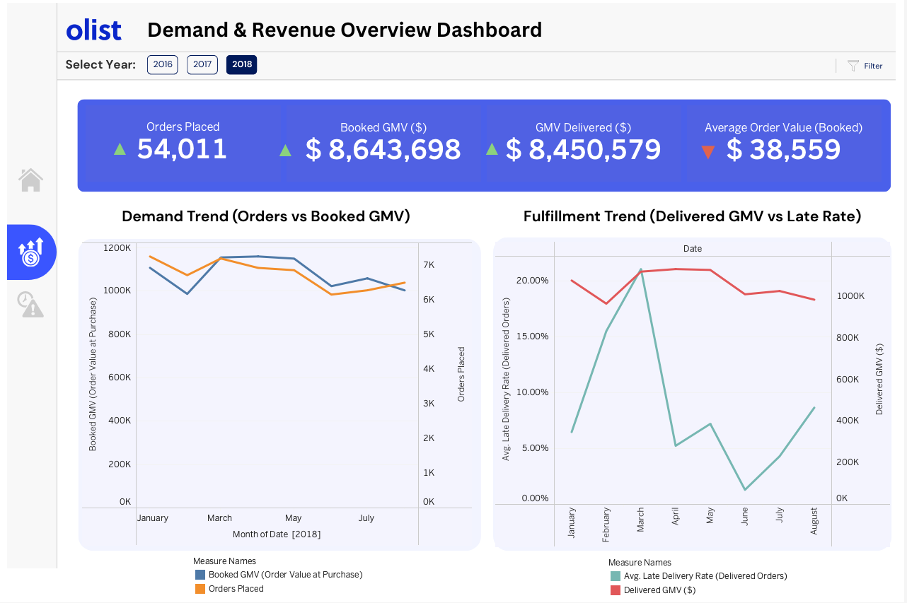
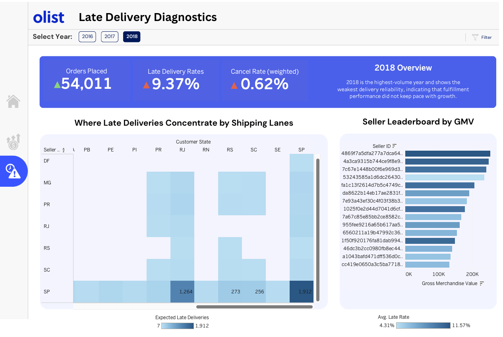

# Olist Ecommerce Analytics Warehouse (Postgres) — Revenue vs Delivery Reliability

## Project Summary
Ecommerce teams need a reliable way to monitor revenue and operational health, especially cancellations and late deliveries that impact customer experience. Raw transactional tables make it hard to answer basic questions like “Are we improving delivery reliability?” or “Which sellers/routes are driving SLA risk?” without repeated, error-prone joins.

This project builds an end-to-end PostgreSQL analytics warehouse on the Olist dataset, modeling clean facts/dimensions and producing BI-ready marts. The resulting KPIs track GMV/AOV, cancellations, and delivery SLA (late rate + late severity) and enable seller- and route-level performance analysis for dashboarding and decision support.

## Dashboard Preview

**Demand & Revenue Dashboard:**

➡️ **Interactive Dashboard:** [Open in Tableau]([PASTE_YOUR_TABLEAU_URL_HERE](https://public.tableau.com/app/profile/sirinya.hirunviriya/viz/OlistEcommerceAnalyticsDashboard-RevenuevsDeliveryReliability/Homepage))

**Late Delivery & Diagnostic Dashboard:**

➡️ **Interactive Dashboard:** [Open in Tableau]([PASTE_YOUR_TABLEAU_URL_HERE](https://public.tableau.com/app/profile/sirinya.hirunviriya/viz/OlistEcommerceAnalyticsDashboard-RevenuevsDeliveryReliability/Homepage))

---

## Dataset Scale
This project uses the **Olist Brazilian ecommerce dataset** , a real-world marketplace dataset that includes customer orders, order items, payments, reviews, products, sellers, and delivery timestamps. The warehouse is built on the core transaction tables (orders + order_items) and enriched with seller/customer/product dimensions.

- **Orders:** 99,441  
- **Order items:** 112,650  
- **Total GMV (booked):** 15,843,553.24  
- **Avg daily late rate (delivered orders):** 6.74%

---

## Business Questions
This project focuses on e-commerce performance and operational health questions that BI teams support for revenue, CX, and logistics decision-making:

- How do **GMV and order volume** trend over time?
- What is the **cancellation rate**, and when does it spike?
- What is our **delivery reliability** (late rate) and **late severity** (days late when late)?
- Which **sellers** generate the most GMV, and how do they perform on SLA + reviews?
- Which **routes** (seller_state → customer_state) have the worst late outcomes?

---

## Warehouse Architecture
Pipeline follows a standard analytics warehouse pattern through the following:

**raw → stg → dwh → mart**

### Schemas
- **raw**: direct CSV loads (minimal changes)
- **stg**: typed/cleaned columns (timestamps, numerics, derived fields)
- **dwh**: dimensional model (facts + dims)
- **mart**: KPI tables for dashboarding

---

## Data Model (Dimensional)
### Facts
- **`dwh.fact_orders`** (grain: 1 row per order)  
  Key fields:
  - `order_gmv` (booked revenue at order grain)
  - `is_delivered`, `is_late`
  - `delay_days` (delivered - estimated; can be negative = early)
  - `days_late` (positive, only when late)
  - `avg_review_score`

- **`dwh.fact_order_items`** (grain: 1 row per order item)  
  Key fields:
  - `price`, `freight_value`, `item_revenue`
  - `seller_id`, `product_id`

### Dimensions
- **`dwh.dim_customer`** (state/city)
- **`dwh.dim_seller`** (state/city)
- **`dwh.dim_product`** (product category + attributes)

---

## BI Marts (Dashboard-Ready)
### 1) `mart.daily_kpis` (daily time series)
Daily metrics for trend monitoring:
- Orders: `orders`, `delivered_orders`, `canceled_orders`, `cancel_rate`
- Revenue: `gmv_booked`, `aov_booked`, `gmv_delivered`, `aov_delivered`
- SLA: `late_rate`, `avg_delay_days`
- Satisfaction: `avg_review_score`

> **Note on NULLs:**  
> `late_rate` and `gmv_delivered` can be **NULL** on days with **0 delivered orders** (often cancel-only days).  
> This is mathematically correct (rate is undefined when denominator = 0). In Tableau, you can display it as 0 using `IFNULL([late_rate], 0)`.

### 2) `mart.seller_scorecard` (seller leaderboard)
Seller-level performance:
- `orders`, `delivered_orders`
- `gmv_booked`, `aov_booked`
- `late_rate`
- `avg_days_late_when_late` (late severity)
- `avg_review_score`

---

## Key Insight Examples
- Overall delivery SLA is **not uniform**: avg daily late rate is **~6.74%**, but certain routes show much higher late rates.
- Late severity matters: among late deliveries, some routes average **~9–15 days late**, which would be operationally meaningful for logistics and seller management.
- Revenue vs reliability tradeoff: top-GMV sellers can still have elevated late rates, motivating segmentation and targeted interventions.

---

## Project Structure
Suggested repo layout:

```txt
olist-bie/
  data/
    raw/                       # CSV files
  sql/
    01_schema/                 # create schemas + raw table DDL
    02_staging/                # stg tables (typed + cleaned)
    03_warehouse/              # facts + dims
    04_marts/                  # mart tables
    05_analysis/               # analysis queries (hotspots, scorecards)
   pictures/                   # dashboard preview
  README.md

